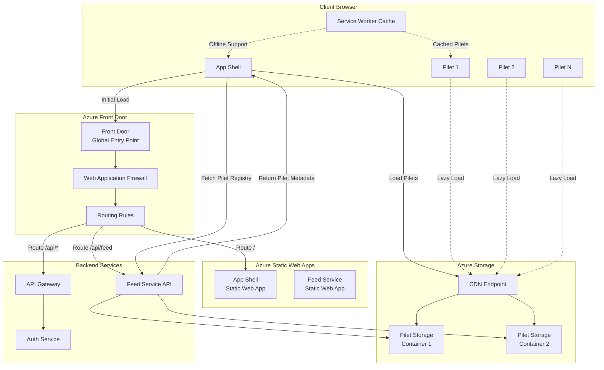

# A Plugin Architecture for Modern Web Applications
## Leveraging Piral Framework with Azure Cloud Infrastructure

### Version 1.0
### November 2025

---

## Executive Summary

In the evolving landscape of web applications, the need for extensible, maintainable, and scalable architectures has never been more pressing. This document proposes a plugin-based architecture using the Piral framework, a battle-tested solution for micro frontend development that embraces the principles of distributed systems while maintaining the coherence of a unified application.

The architecture we propose here isn't merely about technical decomposition—it's about creating a sustainable ecosystem where multiple teams can work independently, deploy autonomously, and innovate without stepping on each other's toes. By combining Piral's robust plugin system with Azure's cloud infrastructure, we create a foundation that scales both technically and organizationally.

---

## 1. Introduction: The Plugin Imperative

When we examine successful software platforms—whether it's Visual Studio Code, WordPress, or Salesforce—we find a common thread: extensibility through plugins. This pattern isn't accidental. It emerges from a fundamental tension in software development: the need for a stable core that provides consistency and reliability, coupled with the requirement for rapid innovation and customization at the edges.

Traditional monolithic architectures fail this test. They become bottlenecks where every change requires coordination, every deployment risks the entire system, and innovation slows to the pace of the slowest-moving component. Microservices promised to solve these issues but often introduced their own complexity around service discovery, data consistency, and operational overhead.

The plugin architecture we propose sits in a sweet spot. It provides the deployment independence of microservices with the user experience coherence of a monolith. More importantly, it creates clear boundaries—not just technical boundaries, but organizational ones. Teams can own their plugins entirely, from development through deployment, without needing to understand the entire system.

### 1.1 Why Piral?

Piral emerges from years of experience building micro frontend architectures in enterprise settings. Unlike naive approaches that simply load multiple JavaScript bundles, Piral provides a complete ecosystem:

- **A robust plugin lifecycle** that handles loading, initialization, and teardown
- **Shared dependencies** that prevent the bloat of duplicated libraries
- **Cross-plugin communication** through a well-defined API
- **Development tooling** that makes building plugins as simple as building standalone applications

But perhaps most importantly, Piral understands that technical architecture is organizational architecture. Its plugin model maps naturally to team boundaries, allowing Conway's Law to work in our favor rather than against us.

---

## 2. Architectural Overview

The architecture consists of three primary layers, each with distinct responsibilities and characteristics. This separation isn't merely for conceptual clarity—it drives our deployment strategy, security model, and development workflow.

### 2.1 The App Shell

At the heart of our architecture sits the Piral app shell—a deliberately thin layer that provides essential services without dictating business logic. Think of it as the operating system for our web application: it manages resources, enforces boundaries, and provides common services, but the actual work happens in the plugins.

```typescript
// App Shell Configuration
import { createInstance } from 'piral';
import { layout, errors } from './layout';

const instance = createInstance({
  state: {
    components: layout,
    errorComponents: errors,
  },
  plugins: {
    // Plugin discovery and loading configuration
    feed: 'https://feed.example.com/api/v1/pilets',
    strategy: 'blazing', // Aggressive caching with background updates
  },
  services: {
    // Shared services available to all plugins
    authentication: () => import('./services/auth'),
    analytics: () => import('./services/analytics'),
    notifications: () => import('./services/notifications'),
  },
});
```

The app shell's responsibilities are carefully circumscribed:
- **Plugin discovery and loading** through the Piral Feed Service
- **Authentication and authorization** providing a security context for plugins
- **Common UI framework** including navigation, headers, and error boundaries
- **Shared services** that plugins can consume but not modify
- **Cross-plugin communication** through a message bus pattern

What the app shell explicitly does not do is equally important:
- It contains no business logic
- It makes no assumptions about plugin capabilities
- It doesn't maintain application state beyond plugin registry

### 2.2 The Plugin Layer (Pilets)

Plugins, or "pilets" in Piral terminology, represent the actual functionality of our application. Each pilet is a self-contained unit that can be developed, tested, and deployed independently. This independence isn't just operational—it's architectural. A pilet failure shouldn't cascade to other pilets or the shell.

```typescript
// Example Pilet: Dashboard Analytics
import { PiletApi } from 'app-shell';

export function setup(api: PiletApi) {
  // Register components
  api.registerPage('/analytics', lazy(() => import('./pages/Analytics')));
  
  // Register tiles for dashboard composition
  api.registerTile('analytics-summary', () => import('./tiles/SummaryTile'), {
    initialColumns: 4,
    initialRows: 2,
  });
  
  // Register menu items
  api.registerMenu('analytics', {
    label: 'Analytics',
    icon: 'chart-line',
    priority: 10,
  });
  
  // Subscribe to cross-pilet events
  api.on('data-refresh', (scope) => {
    if (scope === 'analytics' || scope === 'all') {
      refreshAnalyticsData();
    }
  });
  
  // Expose capabilities to other pilets
  api.registerExtension('data-export', {
    format: 'analytics',
    handler: exportAnalyticsData,
  });
}
```

This example illustrates several key patterns:
- **Lazy loading** ensures code is only loaded when needed
- **Component registration** allows the shell to compose the UI dynamically
- **Event-based communication** enables loose coupling between pilets
- **Capability exposure** lets pilets extend each other without direct dependencies

### 2.3 Infrastructure Layer

The infrastructure layer, built on Azure's cloud platform, provides the foundation for our distributed architecture. This isn't just about hosting—it's about creating a resilient, scalable, and secure platform that can evolve with our needs.

---

## 3. Architecture Diagram



This architecture deliberately separates concerns across multiple Azure services, each optimized for its specific role. The Front Door provides global distribution and protection, Static Web Apps offer serverless scaling for our shell, and blob storage with CDN acceleration ensures pilets load quickly worldwide.

---

## 4. Component Deep Dive

### 4.1 The Piral App Shell

The app shell is the cornerstone of our architecture, but its importance lies not in what it does, but in what it enables. By providing a stable platform with well-defined extension points, it allows innovation to happen at the edges without destabilizing the core.

#### 4.1.1 Shell Initialization

The initialization sequence is carefully orchestrated to provide the best user experience while maintaining security and performance:

```typescript
// Shell Initialization with Progressive Enhancement
import { renderInstance } from 'piral';
import { createInstance } from './app-instance';

// Phase 1: Immediate render with cached data
const instance = createInstance({
  async beforeInit() {
    // Load critical data from IndexedDB
    const cachedPilets = await loadCachedPilets();
    const userContext = await loadCachedUserContext();
    
    return {
      pilets: cachedPilets,
      context: userContext,
    };
  },
});

// Phase 2: Render immediately with whatever we have
renderInstance({
  instance,
  layout: {
    // Provide loading states for async components
    LoadingIndicator: () => <SkeletonLoader />,
    ErrorBoundary: ({ error, reset }) => <ErrorFallback error={error} onReset={reset} />,
  },
});

// Phase 3: Background refresh
instance.root.initialize().then(async () => {
  // Fetch fresh pilet feed
  const freshPilets = await instance.options.fetchPilets();
  
  // Differential update - only reload changed pilets
  const updates = diffPilets(instance.pilets, freshPilets);
  if (updates.length > 0) {
    await instance.injectPilets(updates);
    notifyUser('Application updated in background');
  }
});
```

This three-phase approach ensures users see content immediately while the system updates in the background—a pattern borrowed from progressive web apps but adapted for our plugin architecture.

#### 4.1.2 Service Layer

The shell provides shared services that pilets can consume. These services are carefully designed to be stateless and side-effect free from the pilet's perspective:

```typescript
// Shared Services Definition
export interface SharedServices {
  auth: AuthenticationService;
  notifications: NotificationService;
  analytics: AnalyticsService;
  storage: StorageService;
  i18n: InternationalizationService;
}

// Service Implementation with Facade Pattern
class AuthenticationService {
  private tokenManager: TokenManager;
  private sessionManager: SessionManager;
  
  // Public API for pilets
  async getCurrentUser(): Promise<User> {
    return this.sessionManager.getUser();
  }
  
  async hasPermission(resource: string, action: string): Promise<boolean> {
    const user = await this.getCurrentUser();
    return this.evaluatePermissions(user, resource, action);
  }
  
  // Pilets cannot directly manipulate authentication state
  private async evaluatePermissions(user: User, resource: string, action: string): Promise<boolean> {
    // Implementation details hidden from pilets
  }
}
```

### 4.2 Pilet Architecture

Pilets are where business value lives. Each pilet is a complete micro frontend that happens to run within our shell. This autonomy is crucial—it means teams can choose their own technologies, deployment schedules, and development practices within the bounds of our plugin API.

#### 4.2.1 Pilet Structure

A typical pilet follows a standard structure that balances flexibility with consistency:

```typescript
// pilet: customer-management
// File: src/index.tsx

import { PiletApi } from 'app-shell';
import { CustomerProvider } from './context/CustomerContext';

export function setup(api: PiletApi) {
  // Wrap pilet in its own context provider
  const withProvider = (Component: React.ComponentType) => (props: any) => (
    <CustomerProvider api={api}>
      <Component {...props} />
    </CustomerProvider>
  );
  
  // Register routes
  api.registerPage('/customers', withProvider(lazy(() => import('./pages/CustomerList'))));
  api.registerPage('/customers/:id', withProvider(lazy(() => import('./pages/CustomerDetail'))));
  
  // Register dashboard widgets
  api.registerDashboardTile({
    id: 'customer-metrics',
    component: withProvider(lazy(() => import('./widgets/CustomerMetrics'))),
    defaultSize: { w: 4, h: 2 },
    permissions: ['customers:read'],
  });
  
  // Register extension slots for other pilets to extend
  api.registerExtensionSlot('customer-actions', {
    params: ['customerId', 'customer'],
  });
  
  // Extend other pilets
  api.registerExtension('order-details', 'customer-link', {
    component: lazy(() => import('./extensions/CustomerOrderLink')),
  });
}
```

#### 4.2.2 Inter-Pilet Communication

While pilets are independent, they often need to coordinate. We use a combination of event bus and extension slots for this communication:

```typescript
// Event-based communication
class PiletCommunication {
  // Publisher pilet
  publishDataUpdate(api: PiletApi, data: any) {
    api.emit('data:updated', {
      source: 'customer-management',
      type: 'customer',
      data,
      timestamp: Date.now(),
    });
  }
  
  // Subscriber pilet
  subscribeToUpdates(api: PiletApi) {
    api.on('data:updated', (event) => {
      if (event.type === 'customer') {
        this.handleCustomerUpdate(event.data);
      }
    });
  }
  
  // Request-response pattern
  async requestCustomerData(api: PiletApi, customerId: string) {
    return new Promise((resolve) => {
      const requestId = generateRequestId();
      
      // Set up response listener
      const unsubscribe = api.on('data:response', (response) => {
        if (response.requestId === requestId) {
          unsubscribe();
          resolve(response.data);
        }
      });
      
      // Send request
      api.emit('data:request', {
        requestId,
        type: 'customer',
        id: customerId,
      });
      
      // Timeout after 5 seconds
      setTimeout(() => {
        unsubscribe();
        resolve(null);
      }, 5000);
    });
  }
}
```

### 4.3 Feed Service

The Feed Service is the control plane of our plugin architecture. It manages pilet discovery, versioning, and distribution. Unlike traditional approaches that might hardcode plugin lists, the Feed Service provides dynamic plugin management with sophisticated targeting capabilities.

```typescript
// Feed Service Implementation
interface PiletMetadata {
  name: string;
  version: string;
  link: string;
  integrity: string;
  dependencies: Record<string, string>;
  custom: {
    permissions: string[];
    targetAudience?: {
      roles?: string[];
      features?: string[];
      regions?: string[];
    };
  };
}

class FeedService {
  async getPilets(context: RequestContext): Promise<PiletMetadata[]> {
    const user = await this.authenticateUser(context);
    const allPilets = await this.repository.getAllPilets();
    
    // Filter pilets based on user context
    const applicablePilets = allPilets.filter(pilet => {
      // Check permissions
      if (!this.hasPermissions(user, pilet.custom.permissions)) {
        return false;
      }
      
      // Check audience targeting
      if (pilet.custom.targetAudience) {
        return this.matchesAudience(user, pilet.custom.targetAudience);
      }
      
      return true;
    });
    
    // Apply version resolution
    return this.resolveVersions(applicablePilets, user.preferences);
  }
  
  private resolveVersions(pilets: PiletMetadata[], preferences: UserPreferences): PiletMetadata[] {
    // Implement sophisticated version resolution
    // - Respect version constraints
    // - Consider user preferences (stable vs beta)
    // - Ensure dependency compatibility
    return pilets.map(pilet => {
      if (preferences.betaFeatures && this.hasBetaVersion(pilet)) {
        return this.getBetaVersion(pilet);
      }
      return this.getStableVersion(pilet);
    });
  }
}
```

---

## 5. Azure Infrastructure Design

### 5.1 Static Asset Hosting

Azure Static Web Apps provides the perfect hosting solution for our app shell, offering global distribution, automatic SSL, and built-in authentication. But we go beyond basic hosting to create a sophisticated content delivery architecture:

```yaml
# Azure Static Web App Configuration
# staticwebapp.config.json
{
  "routes": [
    {
      "route": "/api/*",
      "allowedRoles": ["authenticated"]
    },
    {
      "route": "/admin/*",
      "allowedRoles": ["administrator"]
    }
  ],
  "responseOverrides": {
    "404": {
      "rewrite": "/index.html",
      "statusCode": 200
    }
  },
  "globalHeaders": {
    "Cache-Control": "public, max-age=3600",
    "X-Frame-Options": "DENY",
    "X-Content-Type-Options": "nosniff"
  },
  "mimeTypes": {
    ".json": "application/json",
    ".js": "application/javascript",
    ".mjs": "application/javascript"
  }
}
```

### 5.2 Pilet Storage Architecture

Pilets are stored in Azure Blob Storage with a carefully designed structure that supports versioning, rollback, and gradual rollout:

```
Storage Account Structure:
├── pilets-prod/
│   ├── customer-management/
│   │   ├── 1.0.0/
│   │   │   ├── main.js
│   │   │   ├── main.css
│   │   │   └── assets/
│   │   ├── 1.0.1/
│   │   └── latest → 1.0.1
│   ├── order-processing/
│   │   ├── 2.1.0/
│   │   └── latest → 2.1.0
│   └── _metadata/
│       └── feed.json
├── pilets-staging/
└── pilets-dev/
```

This structure enables several important capabilities:
- **Immutable deployments**: Once deployed, a version never changes
- **Instant rollback**: Simply update the 'latest' pointer
- **Gradual rollout**: The feed service can serve different versions to different users
- **Efficient caching**: Immutable paths can be cached forever

### 5.3 Azure Front Door Configuration

Azure Front Door acts as our global entry point, providing several critical services:

```typescript
// Front Door Rules Engine Configuration
const frontDoorRules = [
  {
    name: 'Route to App Shell',
    conditions: [
      { type: 'RequestPath', operator: 'BeginsWith', value: '/' }
    ],
    actions: [
      { type: 'RouteToBackendPool', backendPool: 'app-shell-pool' }
    ]
  },
  {
    name: 'Route to Pilet Storage',
    conditions: [
      { type: 'RequestPath', operator: 'BeginsWith', value: '/pilets' }
    ],
    actions: [
      { type: 'RouteToBackendPool', backendPool: 'storage-pool' },
      { type: 'CacheExpiration', duration: '7d' }
    ]
  },
  {
    name: 'Security Headers',
    conditions: [],
    actions: [
      { type: 'ModifyResponseHeader', action: 'Overwrite', 
        header: 'Strict-Transport-Security', 
        value: 'max-age=31536000; includeSubDomains' },
      { type: 'ModifyResponseHeader', action: 'Overwrite',
        header: 'Content-Security-Policy',
        value: "default-src 'self'; script-src 'self' 'unsafe-inline' https://trusted-cdn.com" }
    ]
  }
];
```

---

## 6. Development Workflow

The development workflow is designed to minimize friction while maintaining quality. We achieve this through a combination of tooling, automation, and well-defined processes.

### 6.1 Local Development

Developers can run the entire system locally using the Piral CLI:

```bash
# Clone the shell repository
git clone https://github.com/company/app-shell
cd app-shell

# Install dependencies
npm install

# Start the shell with mock pilets
npm run start:mocks

# In another terminal, develop your pilet
npx pilet new my-feature-pilet --base app-shell
cd my-feature-pilet
npm start

# The pilet automatically connects to the running shell
```

This setup provides:
- **Hot module replacement** for both shell and pilet
- **Mock services** for testing without backend dependencies
- **TypeScript definitions** generated from the shell API
- **Instant feedback** as changes appear immediately

### 6.2 Continuous Integration

Every pilet push triggers a sophisticated CI pipeline:

```yaml
# Azure DevOps Pipeline for Pilet
trigger:
  branches:
    include:
      - main
      - develop
  paths:
    include:
      - 'src/**'
      - 'package.json'

stages:
  - stage: Build
    jobs:
      - job: BuildPilet
        steps:
          - script: npm ci
          - script: npm run build
          
          # Type checking against shell API
          - script: npm run type-check
          
          # Unit and integration tests
          - script: npm test -- --coverage
          
          # Build for multiple targets
          - script: |
              npm run build:prod
              npm run build:staging
              
          # Security scanning
          - script: npm audit --production
          
          # Bundle size check
          - script: |
              size=$(stat -f%z dist/main.js)
              if [ $size -gt 500000 ]; then
                echo "Bundle too large: ${size} bytes"
                exit 1
              fi

  - stage: Package
    jobs:
      - job: CreatePackage
        steps:
          # Version the pilet
          - script: |
              VERSION=$(npm version patch -m "Release %s [skip ci]")
              echo "##vso[task.setvariable variable=version]$VERSION"
              
          # Package with metadata
          - script: |
              npx pilet pack --target dist/pilet.tgz \
                --metadata.permissions "$(cat permissions.json)" \
                --metadata.audience "$(cat audience.json)"
                
          # Upload to artifact store
          - task: AzureFileCopy@4
            inputs:
              SourcePath: 'dist/pilet.tgz'
              azureSubscription: 'Production'
              Destination: 'AzureBlob'
              storage: 'piletsprod'
              ContainerName: 'releases'
              BlobPrefix: '$(Build.SourceBranchName)/$(version)'

  - stage: Deploy
    condition: and(succeeded(), eq(variables['Build.SourceBranch'], 'refs/heads/main'))
    jobs:
      - deployment: DeployToStaging
        environment: 'staging'
        strategy:
          runOnce:
            deploy:
              steps:
                - script: |
                    # Update feed service
                    curl -X POST $(FEED_SERVICE_URL)/api/pilets \
                      -H "Authorization: Bearer $(DEPLOY_TOKEN)" \
                      -H "Content-Type: application/json" \
                      -d '{
                        "name": "$(PILET_NAME)",
                        "version": "$(version)",
                        "environment": "staging",
                        "url": "$(STORAGE_URL)/$(version)/pilet.tgz"
                      }'
```

### 6.3 Progressive Deployment

We use a sophisticated deployment strategy that minimizes risk while maximizing velocity:

```typescript
// Progressive Rollout Strategy
class ProgressiveRollout {
  async deployPilet(pilet: PiletMetadata, strategy: RolloutStrategy) {
    // Stage 1: Deploy to internal users
    await this.updateAudience(pilet, {
      percentage: 0,
      roles: ['internal-tester'],
    });
    
    await this.waitForMetrics({
      duration: '1h',
      errorThreshold: 0.01,
      performanceThreshold: 100, // ms
    });
    
    // Stage 2: 5% of external users
    await this.updateAudience(pilet, {
      percentage: 5,
      excludeRoles: ['vip-customer'],
    });
    
    await this.waitForMetrics({
      duration: '4h',
      errorThreshold: 0.02,
    });
    
    // Stage 3: 25% rollout
    await this.updateAudience(pilet, {
      percentage: 25,
    });
    
    await this.waitForMetrics({
      duration: '24h',
      errorThreshold: 0.05,
    });
    
    // Stage 4: Full rollout
    await this.updateAudience(pilet, {
      percentage: 100,
    });
    
    // Keep previous version available for quick rollback
    await this.archivePreviousVersion(pilet, { retentionDays: 30 });
  }
}
```

---

## 7. Security Considerations

Security in a plugin architecture requires defense in depth. We can't assume plugins are trustworthy, even our own. Therefore, we implement multiple layers of security:

### 7.1 Content Security Policy

We use a strict CSP that prevents plugins from executing arbitrary code:

```typescript
const cspPolicy = {
  'default-src': ["'self'"],
  'script-src': [
    "'self'",
    "'unsafe-inline'", // Required for Piral's dynamic loading
    "https://*.azurestaticapps.net",
    "https://cdn.example.com",
  ],
  'style-src': ["'self'", "'unsafe-inline'"],
  'img-src': ["'self'", "data:", "https:"],
  'connect-src': [
    "'self'",
    "https://api.example.com",
    "https://*.azure.com",
  ],
  'frame-src': ["'none'"],
  'object-src': ["'none'"],
  'base-uri': ["'self'"],
  'form-action': ["'self'"],
  'frame-ancestors': ["'none'"],
};
```

### 7.2 Pilet Sandboxing

Each pilet runs in its own sandbox with limited access to global objects:

```typescript
class PiletSandbox {
  createSandbox(pilet: PiletMetadata): PiletContext {
    // Create a proxy for the window object
    const sandboxedWindow = new Proxy(window, {
      get(target, prop) {
        // Block access to sensitive APIs
        const blocked = ['localStorage', 'sessionStorage', 'indexedDB'];
        if (blocked.includes(prop as string)) {
          throw new Error(`Access to ${String(prop)} is not allowed`);
        }
        
        // Provide wrapped versions of allowed APIs
        if (prop === 'fetch') {
          return createSandboxedFetch(pilet);
        }
        
        return target[prop as keyof Window];
      },
      
      set(target, prop, value) {
        // Prevent global pollution
        console.warn(`Pilet ${pilet.name} attempted to set global ${String(prop)}`);
        return false;
      }
    });
    
    return {
      window: sandboxedWindow,
      document: createSandboxedDocument(pilet),
      console: createSandboxedConsole(pilet),
    };
  }
}
```

### 7.3 API Gateway Integration

All backend calls go through our API Gateway, which enforces security policies:

```typescript
// API Gateway Middleware
class PiletApiGateway {
  async handleRequest(request: Request, pilet: PiletMetadata): Promise<Response> {
    // Verify pilet identity
    const piletToken = await this.verifyPiletIdentity(request, pilet);
    
    // Check rate limits per pilet
    if (!await this.checkRateLimit(pilet.name)) {
      return new Response('Rate limit exceeded', { status: 429 });
    }
    
    // Add pilet context to request
    const enhancedRequest = new Request(request.url, {
      ...request,
      headers: {
        ...request.headers,
        'X-Pilet-Name': pilet.name,
        'X-Pilet-Version': pilet.version,
        'X-Pilet-Token': piletToken,
      }
    });
    
    // Forward to backend with circuit breaker
    return await this.circuitBreaker.call(() => 
      fetch(enhancedRequest)
    );
  }
}
```

---

## 8. Performance Optimization

Performance in a plugin architecture requires careful attention to loading strategies, caching policies, and runtime optimization. Our approach balances initial load time with runtime performance.

### 8.1 Progressive Loading Strategy

We implement a sophisticated loading strategy that prioritizes user-perceived performance:

```typescript
class ProgressiveLoader {
  async loadApplication() {
    // Phase 1: Critical path (< 50KB)
    await Promise.all([
      this.loadShell(),
      this.loadCriticalCSS(),
      this.loadAuthenticationState(),
    ]);
    
    // Render immediately with skeleton
    this.renderSkeleton();
    
    // Phase 2: Above-the-fold pilets
    const visiblePilets = await this.identifyVisiblePilets();
    await this.loadPilets(visiblePilets, { priority: 'high' });
    
    // Update UI with actual content
    this.renderContent();
    
    // Phase 3: Remaining pilets (background)
    requestIdleCallback(() => {
      this.loadPilets(this.remainingPilets, { priority: 'low' });
    });
    
    // Phase 4: Prefetch likely navigation targets
    if ('connection' in navigator && navigator.connection.effectiveType === '4g') {
      this.prefetchLikelyTargets();
    }
  }
  
  private async loadPilets(pilets: PiletMetadata[], options: LoadOptions) {
    return Promise.all(pilets.map(pilet => 
      this.loadPilet(pilet, options)
    ));
  }
  
  private async loadPilet(pilet: PiletMetadata, options: LoadOptions) {
    // Check cache first
    const cached = await this.cache.get(pilet);
    if (cached && !this.isStale(cached)) {
      return cached;
    }
    
    // Load with priority hints
    const response = await fetch(pilet.link, {
      priority: options.priority,
      integrity: pilet.integrity,
    });
    
    // Store in cache for offline support
    await this.cache.put(pilet, response.clone());
    
    return response;
  }
}
```

### 8.2 Service Worker Strategy

Our service worker implements sophisticated caching strategies tailored to different resource types:

```javascript
// Service Worker Implementation
self.addEventListener('fetch', (event) => {
  const url = new URL(event.request.url);
  
  // Strategy selector
  let strategy;
  
  if (url.pathname.startsWith('/pilets/')) {
    // Pilets: Cache first with background refresh
    strategy = staleWhileRevalidate({
      cacheName: 'pilets-v1',
      plugins: [
        new ExpirationPlugin({
          maxEntries: 50,
          maxAgeSeconds: 7 * 24 * 60 * 60, // 7 days
        }),
      ],
    });
  } else if (url.pathname.startsWith('/api/')) {
    // API: Network first with cache fallback
    strategy = networkFirst({
      cacheName: 'api-v1',
      networkTimeoutSeconds: 3,
      plugins: [
        new ExpirationPlugin({
          maxEntries: 20,
          maxAgeSeconds: 5 * 60, // 5 minutes
        }),
      ],
    });
  } else {
    // Static assets: Cache first
    strategy = cacheFirst({
      cacheName: 'static-v1',
      plugins: [
        new ExpirationPlugin({
          maxEntries: 100,
          maxAgeSeconds: 30 * 24 * 60 * 60, // 30 days
        }),
      ],
    });
  }
  
  event.respondWith(strategy.handle(event));
});
```

---

## 9. Monitoring and Observability

A distributed plugin architecture requires sophisticated monitoring to understand system behavior and diagnose issues. We implement comprehensive observability at multiple levels.

### 9.1 Pilet Performance Tracking

Each pilet is instrumented to track performance metrics:

```typescript
class PiletPerformanceMonitor {
  instrumentPilet(pilet: PiletMetadata, api: PiletApi) {
    const monitor = {
      loadTime: 0,
      renderTime: 0,
      errors: [],
      interactions: [],
    };
    
    // Wrap pilet lifecycle
    const originalSetup = pilet.setup;
    pilet.setup = function(api: PiletApi) {
      const startTime = performance.now();
      
      try {
        // Track component renders
        api.wrapComponent = (Component) => {
          return class extends React.Component {
            componentDidMount() {
              monitor.renderTime = performance.now() - startTime;
              telemetry.record('pilet:rendered', {
                pilet: pilet.name,
                duration: monitor.renderTime,
              });
            }
            
            componentDidCatch(error, errorInfo) {
              monitor.errors.push({ error, errorInfo, timestamp: Date.now() });
              telemetry.record('pilet:error', {
                pilet: pilet.name,
                error: error.toString(),
              });
            }
            
            render() {
              return <Component {...this.props} />;
            }
          };
        };
        
        return originalSetup.call(this, api);
      } finally {
        monitor.loadTime = performance.now() - startTime;
        telemetry.record('pilet:loaded', {
          pilet: pilet.name,
          duration: monitor.loadTime,
        });
      }
    };
  }
}
```

### 9.2 Distributed Tracing

We implement distributed tracing across pilets to understand request flow:

```typescript
class DistributedTracing {
  createSpan(operation: string, pilet: string): Span {
    const span = {
      traceId: this.currentTraceId || this.generateTraceId(),
      spanId: this.generateSpanId(),
      operation,
      pilet,
      startTime: performance.now(),
      tags: {},
      logs: [],
    };
    
    // Propagate trace context to API calls
    this.interceptFetch(span);
    
    return {
      addTag: (key: string, value: any) => {
        span.tags[key] = value;
      },
      
      log: (message: string) => {
        span.logs.push({
          timestamp: performance.now(),
          message,
        });
      },
      
      finish: () => {
        span.endTime = performance.now();
        span.duration = span.endTime - span.startTime;
        
        // Send to telemetry service
        this.sendSpan(span);
      },
    };
  }
  
  private interceptFetch(span: Span) {
    const originalFetch = window.fetch;
    window.fetch = async (input, init = {}) => {
      // Add trace headers
      const headers = new Headers(init.headers);
      headers.set('X-Trace-Id', span.traceId);
      headers.set('X-Parent-Span-Id', span.spanId);
      headers.set('X-Span-Id', this.generateSpanId());
      
      return originalFetch(input, { ...init, headers });
    };
  }
}
```

---

## 10. Disaster Recovery and Business Continuity

In a distributed architecture, failure is inevitable. Our disaster recovery strategy assumes failure and designs for resilience.

### 10.1 Multi-Region Deployment

We deploy across multiple Azure regions with automatic failover:

```yaml
# Traffic Manager Configuration
resource trafficManagerProfile 'Microsoft.Network/trafficManagerProfiles@2022-04-01' = {
  name: 'app-traffic-manager'
  location: 'global'
  properties: {
    profileStatus: 'Enabled'
    trafficRoutingMethod: 'Performance'
    dnsConfig: {
      relativeName: 'app-global'
      ttl: 30
    }
    monitorConfig: {
      protocol: 'HTTPS'
      port: 443
      path: '/health'
      intervalInSeconds: 30
      timeoutInSeconds: 10
      toleratedNumberOfFailures: 3
    }
    endpoints: [
      {
        name: 'primary-us-east'
        type: 'Microsoft.Network/trafficManagerProfiles/azureEndpoints'
        properties: {
          targetResourceId: primaryFrontDoor.id
          endpointStatus: 'Enabled'
          priority: 1
        }
      }
      {
        name: 'secondary-eu-west'
        type: 'Microsoft.Network/trafficManagerProfiles/azureEndpoints'
        properties: {
          targetResourceId: secondaryFrontDoor.id
          endpointStatus: 'Enabled'
          priority: 2
        }
      }
    ]
  }
}
```

### 10.2 Offline Resilience

The application continues to function even when completely offline:

```typescript
class OfflineResilience {
  async initializeOfflineSupport() {
    // Store critical data in IndexedDB
    const db = await this.openDatabase();
    
    // Cache essential pilets
    await this.cacheEssentialPilets(db);
    
    // Set up sync when back online
    window.addEventListener('online', () => {
      this.syncOfflineChanges(db);
    });
    
    // Provide offline indicators
    window.addEventListener('offline', () => {
      this.showOfflineIndicator();
      this.switchToOfflineMode();
    });
  }
  
  private async cacheEssentialPilets(db: IDBDatabase) {
    const essentialPilets = await this.identifyEssentialPilets();
    
    for (const pilet of essentialPilets) {
      const response = await fetch(pilet.link);
      const blob = await response.blob();
      
      // Store in IndexedDB
      await db.transaction('pilets', 'readwrite')
        .objectStore('pilets')
        .put({
          name: pilet.name,
          version: pilet.version,
          content: blob,
          timestamp: Date.now(),
        });
    }
  }
  
  async loadPiletOffline(piletName: string): Promise<Blob | null> {
    const db = await this.openDatabase();
    const pilet = await db.transaction('pilets', 'readonly')
      .objectStore('pilets')
      .get(piletName);
    
    return pilet?.content || null;
  }
}
```

---

## 11. Migration Strategy

Moving to a plugin architecture is a journey, not a destination. Our migration strategy allows for gradual adoption while maintaining system stability.

### 11.1 Strangler Fig Pattern

We use the Strangler Fig pattern to gradually replace the monolith:

```typescript
// Facade that routes between legacy and new systems
class MigrationFacade {
  constructor(
    private legacyApp: LegacyApplication,
    private piralShell: PiralShell,
    private migrationConfig: MigrationConfig
  ) {}
  
  async handleRoute(path: string): Promise<void> {
    // Check if route has been migrated
    const migration = this.migrationConfig.routes[path];
    
    if (!migration) {
      // Not migrated - use legacy
      return this.legacyApp.handleRoute(path);
    }
    
    if (migration.status === 'dual-write') {
      // Transition period - write to both, read from legacy
      await Promise.all([
        this.legacyApp.handleRoute(path),
        this.piralShell.handleRoute(path),
      ]);
      return;
    }
    
    if (migration.status === 'migrated') {
      // Fully migrated - use new system
      return this.piralShell.handleRoute(path);
    }
    
    // Feature flag controlled
    if (await this.featureFlags.isEnabled(migration.flag)) {
      return this.piralShell.handleRoute(path);
    } else {
      return this.legacyApp.handleRoute(path);
    }
  }
}
```

### 11.2 Incremental Pilet Creation

We provide tools to wrap existing code as pilets:

```typescript
// Legacy Code Wrapper
export function wrapLegacyModule(legacyModule: any): PiletSetup {
  return (api: PiletApi) => {
    // Initialize legacy module with compatibility layer
    const compat = createCompatibilityLayer(api);
    legacyModule.initialize(compat);
    
    // Register legacy routes
    Object.keys(legacyModule.routes).forEach(path => {
      api.registerPage(path, () => 
        createLegacyWrapper(legacyModule.routes[path])
      );
    });
    
    // Bridge legacy events to Piral event system
    legacyModule.events.on('*', (event: any) => {
      api.emit(`legacy:${event.type}`, event.data);
    });
    
    // Provide legacy services through Piral API
    api.registerService('legacy', {
      getData: legacyModule.getData.bind(legacyModule),
      saveData: legacyModule.saveData.bind(legacyModule),
    });
  };
}
```

---

## 12. Example Implementation

Let's bring these concepts together with a complete example of a dashboard pilet that showcases the architecture's capabilities.

### 12.1 Dashboard Pilet

```typescript
// dashboard-pilet/src/index.tsx
import { PiletApi } from 'app-shell';
import { DashboardProvider } from './providers/DashboardProvider';

export function setup(api: PiletApi) {
  // Register main dashboard page
  api.registerPage('/dashboard', lazy(() => import('./pages/Dashboard')), {
    layout: 'full-width',
  });
  
  // Register dashboard configuration page
  api.registerPage('/dashboard/configure', 
    lazy(() => import('./pages/DashboardConfigure')), {
    permissions: ['dashboard:configure'],
  });
  
  // Expose dashboard tile registry for other pilets
  api.registerService('dashboard', {
    registerTile: (config: TileConfig) => {
      DashboardProvider.registerTile(config);
    },
    
    removeTile: (tileId: string) => {
      DashboardProvider.removeTile(tileId);
    },
    
    getTiles: () => DashboardProvider.getTiles(),
  });
  
  // Listen for tile updates from other pilets
  api.on('dashboard:tile:update', (event) => {
    DashboardProvider.updateTile(event.tileId, event.data);
  });
  
  // Register data refresh capability
  api.registerCapability('refresh', {
    handler: async (scope: string) => {
      if (scope === 'dashboard' || scope === 'all') {
        await DashboardProvider.refreshAllTiles();
      }
    },
  });
}

// dashboard-pilet/src/pages/Dashboard.tsx
import React, { useState, useEffect } from 'react';
import GridLayout from 'react-grid-layout';
import { usePiletApi } from 'piral-core';
import { DashboardTile } from '../components/DashboardTile';
import { TileConfig, LayoutItem } from '../types';

export const Dashboard: React.FC = () => {
  const api = usePiletApi();
  const [tiles, setTiles] = useState<TileConfig[]>([]);
  const [layout, setLayout] = useState<LayoutItem[]>([]);
  const [isEditing, setIsEditing] = useState(false);
  
  useEffect(() => {
    // Load user's dashboard configuration
    loadDashboardConfig();
    
    // Subscribe to tile registry changes
    const unsubscribe = api.on('dashboard:tiles:changed', () => {
      loadAvailableTiles();
    });
    
    return unsubscribe;
  }, []);
  
  const loadDashboardConfig = async () => {
    const config = await api.getData('dashboard-config');
    if (config) {
      setLayout(config.layout);
      setTiles(config.tiles);
    } else {
      // Load default configuration
      const defaultTiles = await api.getService('dashboard').getTiles();
      setTiles(defaultTiles.filter(t => t.defaultEnabled));
    }
  };
  
  const saveDashboardConfig = async (newLayout: LayoutItem[]) => {
    await api.setData('dashboard-config', {
      layout: newLayout,
      tiles: tiles,
      lastModified: Date.now(),
    });
    
    // Notify other components
    api.emit('dashboard:config:saved', { layout: newLayout });
  };
  
  const renderTile = (tile: TileConfig) => {
    return (
      <div key={tile.id} className="dashboard-tile">
        <DashboardTile
          config={tile}
          isEditing={isEditing}
          onRemove={() => removeTile(tile.id)}
          onConfigure={() => configureTile(tile.id)}
        />
      </div>
    );
  };
  
  return (
    <div className="dashboard-container">
      <header className="dashboard-header">
        <h1>Dashboard</h1>
        <div className="dashboard-actions">
          <button onClick={() => setIsEditing(!isEditing)}>
            {isEditing ? 'Done' : 'Edit'}
          </button>
          {isEditing && (
            <button onClick={() => api.showModal('add-tile-modal')}>
              Add Tile
            </button>
          )}
        </div>
      </header>
      
      <GridLayout
        className="dashboard-grid"
        layout={layout}
        cols={12}
        rowHeight={100}
        width={1200}
        isDraggable={isEditing}
        isResizable={isEditing}
        onLayoutChange={(newLayout) => {
          if (isEditing) {
            saveDashboardConfig(newLayout);
          }
        }}
      >
        {tiles.map(renderTile)}
      </GridLayout>
    </div>
  );
};

// dashboard-pilet/src/components/DashboardTile.tsx
import React, { Suspense, useMemo } from 'react';
import { ErrorBoundary } from '../components/ErrorBoundary';
import { TileConfig } from '../types';
import { TileLoader } from './TileLoader';

interface DashboardTileProps {
  config: TileConfig;
  isEditing: boolean;
  onRemove: () => void;
  onConfigure: () => void;
}

export const DashboardTile: React.FC<DashboardTileProps> = ({
  config,
  isEditing,
  onRemove,
  onConfigure,
}) => {
  const TileComponent = useMemo(() => {
    // Dynamically load tile component
    return lazy(() => 
      import(`../tiles/${config.type}`).catch(() => 
        import('../tiles/ErrorTile')
      )
    );
  }, [config.type]);
  
  return (
    <div className={`tile-wrapper ${isEditing ? 'editing' : ''}`}>
      {isEditing && (
        <div className="tile-controls">
          <button onClick={onConfigure} aria-label="Configure">⚙️</button>
          <button onClick={onRemove} aria-label="Remove">✕</button>
        </div>
      )}
      
      <ErrorBoundary fallback={<div>Tile failed to load</div>}>
        <Suspense fallback={<TileLoader />}>
          <TileComponent {...config.props} />
        </Suspense>
      </ErrorBoundary>
    </div>
  );
};
```

---

## 13. Conclusion

The plugin architecture we've outlined here represents more than a technical solution—it's a organizational strategy for sustainable software development. By combining Piral's proven micro frontend framework with Azure's cloud infrastructure, we create a platform that can evolve with our needs.

The key insights that drive this architecture:

1. **Boundaries enable autonomy**: Clear plugin boundaries allow teams to work independently while maintaining system coherence.

2. **Progressive enhancement over big bang**: The ability to gradually migrate and deploy reduces risk and accelerates value delivery.

3. **Resilience through redundancy**: Multiple layers of caching, offline support, and regional deployment ensure system availability.

4. **Security by design**: Sandboxing, CSP, and API gateway integration provide defense in depth without impeding development.

5. **Observable by default**: Comprehensive monitoring and tracing make the invisible visible, crucial for distributed systems.

This architecture is not without tradeoffs. The initial complexity is higher than a monolithic application. The debugging across plugin boundaries requires sophisticated tooling. The coordination overhead for cross-cutting changes increases. However, for applications that require extensibility, team autonomy, and independent deployment, these tradeoffs are not just acceptable—they're necessary.

The path forward is clear: start with the shell, add plugins incrementally, and let the architecture evolve with your needs. The plugin architecture is not a destination but a journey toward more maintainable, scalable, and resilient web applications.

---

## Appendices

### Appendix A: Technology Stack

- **Frontend Framework**: React 18+ with TypeScript
- **Micro Frontend Framework**: Piral 1.x
- **Build Tools**: Webpack 5, ESBuild
- **Cloud Platform**: Azure (Static Web Apps, Front Door, Blob Storage)
- **Monitoring**: Application Insights, Custom Telemetry
- **CI/CD**: Azure DevOps Pipelines
- **Testing**: Jest, React Testing Library, Playwright

### Appendix B: References

1. Martin Fowler, "Micro Frontends", martinfowler.com, 2019
2. Piral Documentation, docs.piral.io
3. Azure Architecture Center, docs.microsoft.com/azure/architecture
4. "Building Micro Frontends" by Luca Mezzalira, O'Reilly, 2021
5. "Plugin Architecture Patterns" by various authors, IEEE Software, 2020

### Appendix C: Glossary

- **Pilet**: A plugin module in the Piral framework
- **App Shell**: The core application that hosts and orchestrates pilets
- **Feed Service**: Service that provides pilet discovery and metadata
- **Azure Front Door**: Global entry point and CDN service
- **Service Worker**: Browser technology for offline support and caching

---

*This document represents a living architecture that will evolve as we learn from implementation. Regular reviews and updates ensure it remains aligned with both technical capabilities and business needs.*
